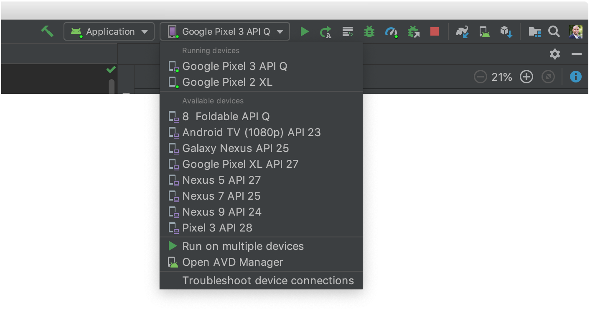
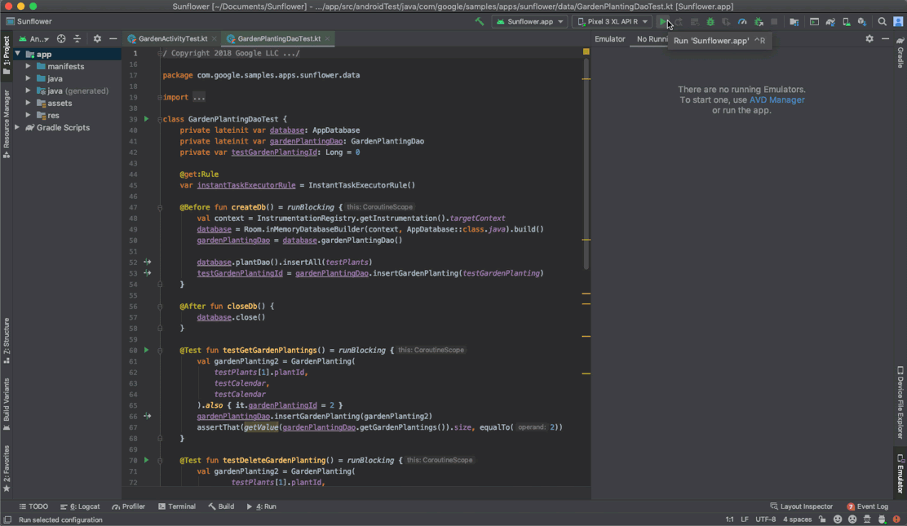

# Run apps on the Android Emulator  \|  Android Developers

## Run apps on the Android Emulator


[https://developer.android.com/studio/run/emulator](https://developer.android.com/studio/run/emulator)


The Android Emulator simulates Android devices on your computer so that you can test your application on a variety of devices and Android API levels without needing to have each physical device.

The emulator provides almost all of the capabilities of a real Android device. You can simulate incoming phone calls and text messages, specify the location of the device, simulate different network speeds, simulate rotation and other hardware sensors, access the Google Play Store, and much more.

Testing your app on the emulator is in some ways faster and easier than doing so on a physical device. For example, you can transfer data faster to the emulator than to a device connected over USB.

The emulator comes with predefined configurations for various Android phone, tablet, Wear OS, and Android TV devices.

Watch the following video for an overview of some emulator features.



You can use the emulator manually through its graphical user interface and programmatically through the command line and the emulator console. For a comparison of the features available through each interface, see [Comparison of Android Emulator tools](https://developer.android.com/studio/run/emulator-comparison).

## Requirements and recommendations <a id="requirements"></a>

The Android Emulator has additional requirements beyond the basic [system requirements for Android Studio](https://developer.android.com/studio#Requirements), which are described below:

* [SDK Tools](https://developer.android.com/studio/releases/sdk-tools) 26.1.1 or higher
* 64-bit processor
* Windows: CPU with UG \(unrestricted guest\) support
* HAXM 6.2.1 or later \(HAXM 7.2.0 or later recommended\)

The use of [hardware acceleration](https://developer.android.com/studio/run/emulator-acceleration) has additional requirements on Windows and Linux:

* Intel processor on Windows or Linux: Intel processor with support for Intel VT-x, Intel EM64T \(Intel 64\), and Execute Disable \(XD\) Bit functionality
* AMD processor on Linux: AMD processor with support for AMD Virtualization \(AMD-V\) and [Supplemental Streaming SIMD Extensions 3 \(SSSE3\)](https://en.wikipedia.org/wiki/SSSE3)
* AMD processor on Windows: Android Studio 3.2 or higher and Windows 10 April 2018 release or higher for [Windows Hypervisor Platform \(WHPX\)](https://docs.microsoft.com/en-us/virtualization/api/) functionality

To work with Android 8.1 \(API level 27\) and higher system images, an attached webcam must have the capability to capture 720p frames.

### Deprecation for 32-bit Windows systems <a id="emu-win-32-support"></a>

The Android Emulator was deprecated in June 2019 for 32-bit Windows systems. Support for the 32-bit Windows emulator continues until June 2020, including critical bug fixes, but no new features will be added. If you are using the emulator on a 32-bit Windows system, you should plan to migrate to a 64-bit Windows system.

If you are using the emulator on a 32-bit Windows system, you can use the [SDK Manager](https://developer.android.com/studio/intro/update#sdk-manager) to install the latest version of the emulator for 32-bit Windows.

## Install the emulator <a id="install"></a>

To install the Android Emulator, select the **Android Emulator** component in the **SDK Tools** tab of the **SDK Manager**. For instructions, see [Update your tools using the SDK Manager](https://developer.android.com/studio/intro/update#sdk-manager).

## Android virtual devices <a id="avd"></a>

Each instance of the Android Emulator uses an Android virtual device \(AVD\) to specify the Android version and hardware characteristics of the simulated device. To effectively test your app, you should create an AVD that models each device on which your app is designed to run. To create and manage AVDs, use the [AVD Manager](https://developer.android.com/tools/devices/managing-avds).

Each AVD functions as an independent device, with its own private storage for user data, SD card, and so on. By default, the emulator stores the user data, SD card data, and cache in a directory specific to that AVD. When you launch the emulator, it loads the user data and SD card data from the AVD directory.

## Run an app on the Android Emulator <a id="runningapp"></a>

You can run an app from an Android Studio project, or you can run an app that's been installed on the Android Emulator as you would run any app on a device.

To start the Android Emulator and run an app in your project:

* In Android Studio, [create an Android Virtual Device \(AVD\)](https://developer.android.com/studio/run/managing-avds#createavd) that the emulator can use to install and run your app.
* In the toolbar, select the AVD that you want to run your app on from the target device drop-down menu.
* In the toolbar, select the AVD that you want to run your app on from the target device drop-down menu.



*  Click **Run** 

  If you receive an error or warning message at the top of the dialog, click the link to correct the problem or to get more information.

  Some errors you must fix before you can continue, such as certain Hardware Accelerated Execution Manager \(Intel HAXM\) errors.

  For macOS, if you see a `Warning: No DNS servers found` error when starting the emulator, check to see whether you have an `/etc/resolv.conf` file. If you don't have this file, enter the following command in a terminal window:

```text
ln -s /private/var/run/resolv.conf /etc/resolv.conf
```

## Launch the Android Emulator without first running an app <a id="runningemulator"></a>

To start the emulator:

1. [Open the AVD Manager](https://developer.android.com/tools/devices/managing-avds).
2. Double-click an AVD, or Click **Run** 

   The Android Emulator loads.

While the emulator is running, you can run Android Studio projects and choose the emulator as the target device. You can also drag one or more APKs onto the emulator to install them, and then run them.

## Run the Android Emulator directly in Android Studio <a id="run-emulator-studio"></a>

Run the Android Emulator directly in Android Studio to conserve screen real estate, to navigate quickly between the emulator and the editor window using hotkeys, and to organize your IDE and emulator workflow in a single application window.



To run the emulator in Android Studio, make sure you're using Android Studio 4.1 or higher with version 30.0.10 or higher of the Android Emulator, then follow these steps:

1. Click **File &gt; Settings &gt; Tools &gt; Emulator** \(or **Android Studio &gt; Preferences &gt; Tools &gt; Emulator on macOS**\), then select **Launch in a tool window** and click **OK**.
2. If the Emulator window didn't automatically appear, open it by clicking **View &gt; Tool Windows &gt; Emulator**.
3. Start your virtual device using the **AVD Manager** or by targeting it when running your app.

### Limitations

Currently, you can't use the emulator's extended controls when it's running in a tool window. If your development workflow depends heavily on the extended controls, continue to use the Android Emulator as a standalone application. In addition, certain virtual devices—such as Android TV and foldable devices—can't be run in Android Studio because they have specialized UI requirements or important functions in the extended controls.

## Install and add files <a id="installadd"></a>

To install an APK file on the emulated device, drag an APK file onto the emulator screen. An APK Installer dialog appears. When the installation completes, you can view the app in your apps list.

To add a file to the emulated device, drag the file onto the emulator screen. The file is placed in the `/sdcard/Download/` directory. You can view the file from Android Studio using the [Device File Explorer](https://developer.android.com/studio/debug/device-file-explorer), or find it from the device using the **Downloads** or **Files** app, depending on the device version.

## Snapshots <a id="snapshots"></a>

A _snapshot_ is a stored image of an AVD \(Android Virtual Device\) that preserves the entire state of the device at the time that it was saved – including OS settings, application state, and user data. You can return to a saved system state by loading a snapshot whenever you choose, saving you the time of waiting for the operating system and applications on the virtual device to restart, as well as saving you the effort of bringing your app back to the state at which you want to resume your testing. Starting a virtual device by loading a snapshot is much like waking a physical device from a sleep state, as opposed to booting it from a powered-off state.

For each AVD, you can have one _Quick Boot_ snapshot and any number of general snapshots.

The simplest way to take advantage of snapshots is to use Quick Boot snapshots: By default, each AVD is set to automatically save a Quick Boot snapshot on exit and load from a Quick Boot snapshot on start.

The first time that an AVD starts, it must perform a _cold boot_, just like powering on a device. If Quick Boot is enabled, all subsequent starts load from the specified snapshot, and the system is restored to the state saved in that snapshot.

Snapshots are valid for the system image, AVD configuration, and emulator features with which they are saved. When you make a change in any of these areas, all snapshots of the affected AVD become invalid. Any update to the Android Emulator, system image, or AVD settings resets the AVD's saved state, so the next time you start the AVD, it must perform a cold boot.

Most controls for saving, loading, and managing snapshots are in the **Snapshots** and **Settings** tabs in the **Snapshots** pane in the emulator's [Extended controls]() window.


You can also control the Quick Boot options when [starting the emulator from the command line](https://developer.android.com/studio/run/emulator-commandline#startup-options).

### Save Quick Boot snapshots <a id="save-snapshots-on-exit"></a>

When you close an AVD, you can specify whether the emulator automatically saves a snapshot when you close. To control this behavior, proceed as follows:

1. Open the emulator's [Extended controls]() window.
2. In the **Snapshots** category of controls, navigate to the **Settings** tab.
3. Use the **Auto-save current state to Quickboot** drop-down menu to select one of the following options:

   **Yes**: Always save an AVD snapshot when you close the emulator. This is the default.

* **Yes**: Always save an AVD snapshot when you close the emulator. This is the default.


 **Note:** When automatic Quick Boot snapshots are enabled, you can skip saving a Quick Boot snapshot by holding the `Shift` key down when you close the emulator.


* **No**: Don't save an AVD snapshot when you close the emulator.

Your selection applies only to the AVD that is currently open. You cannot save snapshots while ADB is offline \(such as while the AVD is still booting\).

### Save general snapshots <a id="save-general-snapshot-now"></a>

Whereas you can only have one Quick Boot snapshot for each AVD, you can have multiple general snapshots for each AVD.

To save a general snapshot, open the emulator's [Extended controls]() window, select the **Snapshots** category, and click the **Take snapshot** button in the lower-right corner of the window.

To edit the name and description of the selected snapshot, click the  edit  button  at the bottom of the window.

### Delete a snapshot <a id="delete-snapshot"></a>

To manually delete a snapshot, open the emulator's [Extended controls]() window, select the **Snapshots** category, select the snapshot, and click the   delete  button at the bottom of the window.

You can also specify whether you would like the emulator to automatically delete snapshots when they become invalid, such as when the AVD settings or emulator version change. By default, the emulator will ask you if you'd like for it to delete invalid snapshots. You can change this setting with the **Delete invalid snapshots** menu in the **Settings** tab of the **Snapshots** pane.

### Load a snapshot <a id="load-snapshot"></a>

To load a snapshot at any time, open the emulator's [Extended controls]() window, select the **Snapshots** category, choose a snapshot, and click the  load  button at the bottom of the window.

In Android Studio 3.2 and higher, each device configuration includes a **Boot option** control in the advanced settings in the [Virtual Device Configuration](https://developer.android.com/studio/run/managing-avds) dialog with which you can specify which snapshot to load when starting that AVD.

### Disable Quick Boot <a id="disable-all-quickboot"></a>

If you want to disable Quick Boot so your AVD always performs a cold boot, do the following:

1. Select **Tools &gt; AVD Manager** and click **Edit this**  **AVD** .
2. Click **Show Advanced Settings** and scroll down to **Emulated Performance**.
3. Select **Cold boot**.

### Cold boot once <a id="cold-boot-once"></a>

Instead of disabling Quick Boot completely, you can cold boot just once by clicking **Cold Boot Now** from the AVD's drop-down menu in the **AVD Manager**.


### Snapshot requirements and troubleshooting <a id="quickboot-troubleshooting"></a>

* Snapshots do not work with Android 4.0.4 \(API level 15\) or lower.
* Snapshots do not work with ARM system images for Android 8.0 \(API level 26\).
* If the emulator fails to boot from a snapshot, select **Cold Boot Now** for the AVD in the AVD Manager and [submit a bug report](https://developer.android.com/studio/report-bugs).
* Snapshots are not reliable when software rendering is enabled. If snapshots do not work, click **Edit this  AVD**   in the **AVD Manager** and change **Graphics** to either **Hardware** or **Automatic**.
* Loading or saving a snapshot is a memory-intensive operation. If you do not have enough RAM free when a load or save operation begins, the operating system may swap the contents of RAM to the hard disk, which can greatly slow the operation. If you experience very slow snapshot loads or saves, you may be able to speed these operations by freeing RAM. Closing applications that are not essential for your work is a good way to free RAM.

## Navigate the emulator screen <a id="navigate"></a>

Use your computer mouse pointer to mimic your finger on the touchscreen; select menu items and input fields; and click buttons and controls. Use your computer keyboard to type characters and enter emulator shortcuts.

**Table 1.** Gestures for navigating the emulator

<table>
  <thead>
    <tr>
      <th style="text-align:left"><b>Feature</b>
      </th>
      <th style="text-align:left">Description</th>
    </tr>
  </thead>
  <tbody>
    <tr>
      <td style="text-align:left">Swipe the screen</td>
      <td style="text-align:left">Point to the screen, press and hold the primary mouse button, swipe across
        the screen, and then release.</td>
    </tr>
    <tr>
      <td style="text-align:left">Drag an item</td>
      <td style="text-align:left">Point to an item on the screen, press and hold the primary mouse button,
        move the item, and then release.</td>
    </tr>
    <tr>
      <td style="text-align:left">
        <p>Tap</p>
        <p>(touch)</p>
      </td>
      <td style="text-align:left">Point to the screen, press the primary mouse button, and then release.
        For example, you could click a text field to start typing in it, select
        an app, or press a button.</td>
    </tr>
    <tr>
      <td style="text-align:left">Double tap</td>
      <td style="text-align:left">Point to the screen, press the primary mouse button quickly twice, and
        then release.</td>
    </tr>
    <tr>
      <td style="text-align:left">Touch and hold</td>
      <td style="text-align:left">Point to an item on the screen, press the primary mouse button, hold,
        and then release. For example, you could open options for an item.</td>
    </tr>
    <tr>
      <td style="text-align:left">Type</td>
      <td style="text-align:left">You can type in the emulator by using your computer keyboard, or using
        a keyboard that pops up on the emulator screen. For example, you could
        type in a text field after you selected it.</td>
    </tr>
    <tr>
      <td style="text-align:left">Pinch and spread</td>
      <td style="text-align:left">
        <p>Pressing Control (Command on Mac) brings up a pinch gesture multi-touch
          interface. The mouse acts as the first finger, and across the anchor point
          is the second finger. Drag the cursor to move the first point.</p>
        <p>Clicking the left mouse button acts like touching down both points, and
          releasing acts like picking both up.</p>
      </td>
    </tr>
    <tr>
      <td style="text-align:left">Vertical swipe</td>
      <td style="text-align:left">Open a vertical menu on the screen and use the scroll wheel (mouse wheel)
        to scroll through the menu items until you see the one you want. Click
        the menu item to select it.</td>
    </tr>
  </tbody>
</table>

## Perform common actions in the emulator <a id="tasks"></a>

To perform common actions with the emulator, use the panel on the right side, as described in table 2.

You can use keyboard shortcuts to perform many common actions in the emulator. For a complete list of shortcuts in the emulator, press F1 \(Command+/ on Mac\) to open the Help pane in the [**Extended controls**]() window.

**Table 2.** Common actions in the emulator

<table>
  <thead>
    <tr>
      <th style="text-align:left">Feature</th>
      <th style="text-align:left">Icon</th>
      <th style="text-align:left">Description</th>
    </tr>
  </thead>
  <tbody>
    <tr>
      <td style="text-align:left">Close</td>
      <td style="text-align:left">
        
      </td>
      <td style="text-align:left">Close the emulator.</td>
    </tr>
    <tr>
      <td style="text-align:left">Minimize</td>
      <td style="text-align:left">
        
      </td>
      <td style="text-align:left">Minimize the emulator window.</td>
    </tr>
    <tr>
      <td style="text-align:left">Resize</td>
      <td style="text-align:left"></td>
      <td style="text-align:left">Resize the emulator as you would any other operating system window. The
        emulator maintains an aspect ratio appropriate for your device.</td>
    </tr>
    <tr>
      <td style="text-align:left">Power
        <br />
      </td>
      <td style="text-align:left">
        
      </td>
      <td style="text-align:left">Click to turn the screen on or off.
        <br />Click and hold to turn the device on or off.</td>
    </tr>
    <tr>
      <td style="text-align:left">Volume up</td>
      <td style="text-align:left">
        
      </td>
      <td style="text-align:left">Click to view a slider control and turn the volume up. Click again to
        turn it up more, or use the slider control to change the volume.</td>
    </tr>
    <tr>
      <td style="text-align:left">Volume down</td>
      <td style="text-align:left">
        
      </td>
      <td style="text-align:left">Click to view a slider control and turn the volume down. Click again to
        turn it down more, or use the slider control to change the volume.</td>
    </tr>
    <tr>
      <td style="text-align:left">Rotate left</td>
      <td style="text-align:left">
        
      </td>
      <td style="text-align:left">Rotate the device 90 degrees counterclockwise.</td>
    </tr>
    <tr>
      <td style="text-align:left">Rotate right</td>
      <td style="text-align:left">
        
      </td>
      <td style="text-align:left">Rotate the device 90 degrees clockwise.</td>
    </tr>
    <tr>
      <td style="text-align:left">Take screenshot</td>
      <td style="text-align:left">
        
      </td>
      <td style="text-align:left">Click to take a screenshot of the device. For details, see <a href>Screenshots</a>.</td>
    </tr>
    <tr>
      <td style="text-align:left">Enter zoom mode</td>
      <td style="text-align:left">
        
      </td>
      <td style="text-align:left">
        <p>Click so the cursor changes to the zoom icon. To exit zoom mode, click
          the button again.</p>
        <p>Zoom in and out in zoom mode:</p>
        <ul>
          <li>Left-click the screen to zoom in by 25%, up to a maximum of about twice
            the screen resolution of the virtual device.</li>
          <li>Right-click to zoom out.</li>
          <li>Left-click and drag to select a box-shaped area to zoom in on.</li>
          <li>Right-click and drag a selection box to reset to default zoom.</li>
        </ul>
        <p>To pan in zoom mode, hold Control (Command on Mac) while pressing the
          arrow keys on the keyboard.</p>
        <p>To tap the device screen in zoom mode, Control-click (Command-click on
          Mac).</p>
      </td>
    </tr>
    <tr>
      <td style="text-align:left">Back</td>
      <td style="text-align:left">
        
      </td>
      <td style="text-align:left">Return to the previous screen, or close a dialog box, an options menu,
        the Notifications panel, or the onscreen keyboard.</td>
    </tr>
    <tr>
      <td style="text-align:left">Home</td>
      <td style="text-align:left">
        
      </td>
      <td style="text-align:left">Return to the Home screen.</td>
    </tr>
    <tr>
      <td style="text-align:left">
        <p>Overview</p>
        <p>(Recent Apps)</p>
      </td>
      <td style="text-align:left">
        
      </td>
      <td style="text-align:left">Tap to open a list of thumbnail images of apps you&#x2019;ve worked with
        recently. To open an app, tap it. To remove a thumbnail from the list,
        swipe it left or right. This button isn&apos;t supported for Wear OS.</td>
    </tr>
    <tr>
      <td style="text-align:left">Fold</td>
      <td style="text-align:left">
        
      </td>
      <td style="text-align:left">For foldable devices, fold the device to display its smaller screen configuration.</td>
    </tr>
    <tr>
      <td style="text-align:left">Unfold</td>
      <td style="text-align:left">
        
      </td>
      <td style="text-align:left">For foldable devices, unfold the device to display its larger screen configuration.</td>
    </tr>
    <tr>
      <td style="text-align:left">Menu</td>
      <td style="text-align:left"></td>
      <td style="text-align:left">Press Control+M (Command+M on Mac) to simulate the Menu button.</td>
    </tr>
    <tr>
      <td style="text-align:left">More</td>
      <td style="text-align:left">
        
      </td>
      <td style="text-align:left">Click to access other features and settings, described in the next table.</td>
    </tr>
  </tbody>
</table>

## Screen recording <a id="screen-recording"></a>

You can record video and audio from the Android Emulator and save the recording to a WebM or animated GIF file.

The screen recording controls are in the **Screen record** tab of the [**Extended Controls**]() window.


**Tip:** You can also open the screen recording controls by pressing Control + Shift + R \(Command + Shift + R on Mac\).


To begin screen recording, click the **Start recording** button in the **Screen record** tab. To stop recording, click **Stop recording**.

Controls for playing and saving the recorded video are at the bottom of the **Screen record** tab. To save the video, choose **WebM** or **GIF** from the menu at the bottom of the tab and click **Save**.

You can also record and save a screen recording from the emulator using the following command on the command line:

`adb emu screenrecord start --time-limit 10` _`[path to save video]`_`/sample_video.webm`

## Screenshots <a id="screenshots"></a>

To take a screenshot of the virtual device, click the **Take**  **screenshot**  button

The emulator creates a PNG file with the name `Screenshot_yyyymmdd-hhmmss.png` using the year, month, day, hour, minute, and second of the capture. For example, `Screenshot_20160219-145848.png`.

By default, the screenshot is saved on your computer desktop. To change the location to which screenshots are saved, use the **Screenshot save location** control in the **Settings** category in the emulator's [Extended controls]() window.

You can also take screenshots from the command line with either of the following commands:

* `screenrecord screenshot [destination-directory]`
* `adb emu screenrecord screenshot [destination-directory]`

## Camera support <a id="camera"></a>

The emulator supports the use of basic camera functionality on your virtual device for earlier Android versions. Android 11 and higher supports the following additional Android Emulator camera capabilities:

* RAW capture
* YUV reprocessing
* Level 3 devices
* Logical camera support
* Emulating sensor orientation by using data from the sensor manager
* Applying video stabilization by reducing handshake frequency
* Applying edge enhancement by removing the upscaling usually done in the YUV pipeline
* Concurrent cameras

### Virtual scene camera and ARCore <a id="arcore"></a>

You can use the virtual scene camera in a virtual environment to experiment with augmented reality \(AR\) apps made with [ARCore](https://developers.google.com/ar/discover/).

For information on using the virtual scene camera in the emulator, see [Run AR apps in Android Emulator](https://developers.google.com/ar/develop/java/emulator).

When using the emulator with a camera app, you can import an image in PNG or JPEG format to be used within a virtual scene. To choose an image for use in a virtual scene, click **Add image** in the **Camera &gt; Virtual scene images** tab in the **Extended controls** window. This feature can be used to import custom images such as QR codes for use with any camera-based app. For more information, see [Add Augmented Images to the scene](https://developers.google.com/ar/develop/java/emulator#add_augmented_images_to_the_scene).

### Test common AR actions with macros <a id="ar-macros"></a>

You can greatly reduce the time it takes to test common AR actions by using the preset macros in the emulator. For example, you can use a macro to reset all the device's sensors to their default state.

Before using macros, follow the steps in [Run AR apps in Android Emulator](https://developers.google.com/ar/develop/java/emulator) to set up the virtual scene camera for your app, run your app on the emulator, and update ARCore. Then, follow these steps to use emulator macros:

1. With the emulator running and your app connected to ARCore, click  **More**   in the emulator panel.
2. Select **Record and Playback &gt; Macro Playback**.
3. Choose a macro that you want to use, then click **Play**.

   During playback, you can interrupt a macro by clicking **Stop**.

## Extended controls, settings, and help <a id="extended"></a>

Use the extended controls to send data, change device properties, control apps, and more. To open the **Extended controls** window, click  **More**   in the emulator panel.

You can use keyboard shortcuts to perform many of these tasks. For a complete list of shortcuts in the emulator, press F1 \(Command+/ on Mac\) to open the Help pane.

**Table 3.** Extended controls details

<table>
  <thead>
    <tr>
      <th style="text-align:left">Feature</th>
      <th style="text-align:left">Description</th>
    </tr>
  </thead>
  <tbody>
    <tr>
      <td style="text-align:left">Location</td>
      <td style="text-align:left">
        <p>The emulator lets you simulate &quot;my location&quot; information: the
          location where the emulated device is currently located. For example, if
          you click My Location
          in Google Maps and then send a location, the map shows it.</p>
        <p>Controls for the device&apos;s location information are organized under
          two tabs: <b>Single points</b> and <b>Routes</b>.</p>
        <p> <b>Single points</b>
        </p>
        <p>In the <b>Single points</b> tab, you can use the Google Maps webview to
          search for points of interest, just as you would when using Google Maps
          on a phone or in a browser. When you search for (or click on) a location
          in the map, you can save the location by selecting <b>Save point</b> near
          the bottom of the map. All of your saved locations are listed on the right
          side of the <b>Extended controls</b> window.</p>
        <p>To set the emulators location to the location you have selected on the
          map, click the <b>Set location</b> button near the bottom right of the <b>Extended controls</b> window.</p>
        <p> <b>Routes</b>
        </p>
        <p>Similar to the <b>Single points</b> tab, the <b>Routes</b> tab provides a
          Google Maps webview that you can use to create a route between two or more
          locations. To create and save a route, do the following:</p>
        <ol>
          <li>In the map view, use the text field to search for the first destination
            in your route.</li>
          <li>Select the location from the search results.</li>
          <li>Select the <b>Navigate</b> 
            button.</li>
          <li>Select the starting point of your route from the map.</li>
          <li>(Optional) Click <b>Add destination</b> to add more stops to your route.</li>
          <li>Save your route by clicking <b>Save route</b> in the map view.</li>
          <li>Specify a name for the route and click <b>Save</b>.</li>
        </ol>
        <p>To simulate the emulator following the route you saved, select the route
          from the list of <b>Saved routes</b> and click <b>Play route</b> near the bottom
          right of the <b>Extended controls</b> window. To stop the simulation, click <b>Stop route</b>.</p>
        <p>To continuously simulate the emulator following the specified route, enable
          the switch next to Repeat playback. To change how quickly the emulator
          follows the specified route, select an option from the Playback speed dropdown.</p>
        <p> <b>Import GPX and KML data</b>
        </p>
        <p>To use geographic data from a GPS exchange format (GPX) or Keyhole Markup
          Language (KML) file:</p>
        <ol>
          <li>Click <b>Load GPX/KML</b>.</li>
          <li>In the file dialog, select a file on your computer and click <b>Open</b>.</li>
          <li>
            <p>Optionally select a <b>Speed</b>.</p>
            <p>The speed defaults to the <b>Delay</b> value (<b>Speed 1X</b>). You can
              increase the speed by double (<b>Speed</b>  <b>2X</b>), triple (<b>Speed 3X</b>),
              and so on.</p>
          </li>
          <li>Click <b>Run</b> 
            .</li>
        </ol>
      </td>
    </tr>
    <tr>
      <td style="text-align:left">Displays</td>
      <td style="text-align:left">
        <p>The emulator allows you to deploy your app to multiple displays, which
          support customizable dimensions and can help you test apps that support
          <a
          href="https://developer.android.com/guide/topics/ui/foldables#multi-window">multi- window</a>and <a href="https://developer.android.com/guide/topics/ui/foldables#multi-display">multi- display</a>.
            While a virtual device is running, you can add up to two additional displays
            as follows:</p>
        <ol>
          <li>Add another display by clicking <b>Add secondary display</b>.</li>
          <li>From the dropdown menu under <b>Secondary displays</b>, do one of the following:
            <ol>
              <li>Select one of the preset aspect ratios.</li>
              <li>Select <b>custom</b> and set the <b>height</b>, <b>width</b>, and <b>dpi</b> for
                your custom display.</li>
            </ol>
          </li>
          <li>(Optional) Click <b>Add secondary display</b> to add a third display.</li>
          <li>Click <b>Apply changes</b> to add the specified display(s) to the running
            virtual device.</li>
        </ol>
      </td>
    </tr>
    <tr>
      <td style="text-align:left">Cellular</td>
      <td style="text-align:left">
        <p>The emulator lets you simulate various network conditions. You can approximate
          the network speed for different network protocols, or you can specify <b>Full</b>,
          which transfers data as quickly as your computer allows. Specifying a network
          protocol is always slower than <b>Full</b>. You can also specify the voice
          and data network status, such as roaming. The defaults are set in the AVD.</p>
        <p>Select a <b>Network type</b>:</p>
        <ul>
          <li> <b>GSM</b>: Global System for Mobile Communications</li>
          <li> <b>HSCSD</b>: High-Speed Circuit-Switched Data</li>
          <li> <b>GPRS</b>: Generic Packet Radio Service</li>
          <li> <b>EDGE</b>: Enhanced Data rates for GSM Evolution</li>
          <li> <b>UMTS</b>: Universal Mobile Telecommunications System</li>
          <li> <b>HSPDA</b>: High-Speed Downlink Packet Access</li>
          <li> <b>LTE</b>: Long-Term Evolution</li>
          <li> <b>Full</b> (default): Use the network as provided by your computer</li>
        </ul>
        <p>Select a <b>Signal strength</b>:</p>
        <ul>
          <li> <b>None</b>
          </li>
          <li> <b>Poor</b>
          </li>
          <li> <b>Moderate</b> (default)</li>
          <li> <b>Good</b>
          </li>
          <li> <b>Great</b>
          </li>
        </ul>
        <p>Select a <b>Voice status</b>, <b>Data status</b>, or both:</p>
        <ul>
          <li> <b>Home</b> (default)</li>
          <li> <b>Roaming</b>
          </li>
          <li> <b>Searching</b>
          </li>
          <li> <b>Denied (emergency calls only)</b>
          </li>
          <li> <b>Unregistered (off)</b>
          </li>
        </ul>
      </td>
    </tr>
    <tr>
      <td style="text-align:left">Battery</td>
      <td style="text-align:left">
        <p>You can simulate the battery properties of a device to see how your app
          performs under different conditions. To select a <b>Charge level</b>, use
          the slider control.</p>
        <p>Select a <b>Charger connection</b> value:</p>
        <ul>
          <li><b>None</b>
          </li>
          <li><b>AC charger</b>
          </li>
        </ul>
        <p>Select a <b>Battery health</b> value:</p>
        <ul>
          <li> <b>Good</b> (default)</li>
          <li> <b>Failed</b>
          </li>
          <li> <b>Dead</b>
          </li>
          <li> <b>Overvoltage</b>
          </li>
          <li> <b>Overheated</b>
          </li>
          <li> <b>Unknown</b>
          </li>
        </ul>
        <p>Select a <b>Battery status</b> value:</p>
        <ul>
          <li> <b>Unknown</b>
          </li>
          <li> <b>Charging</b> (default)</li>
          <li> <b>Discharging</b>
          </li>
          <li> <b>Not charging</b>
          </li>
          <li> <b>Full</b>
          </li>
        </ul>
      </td>
    </tr>
    <tr>
      <td style="text-align:left">Phone</td>
      <td style="text-align:left">
        <p>The emulator lets you simulate incoming phone calls and text messages.</p>
        <p>To initiate a call to the emulator:</p>
        <ol>
          <li>Select or type a phone number in the <b>From</b> field.</li>
          <li>Click <b>Call Device</b>.</li>
          <li>Optionally click <b>Hold Call</b> to put the call on hold.</li>
          <li>To end the call, click <b>End Call</b>.</li>
        </ol>
        <p>To send a text message to the emulator:</p>
        <ol>
          <li>Select or type a phone number in the <b>From</b> field.</li>
          <li>Type a message in the <b>SMS message</b> field.</li>
          <li>Click <b>Send Message</b>.</li>
        </ol>
      </td>
    </tr>
    <tr>
      <td style="text-align:left">Directional Pad</td>
      <td style="text-align:left">If the AVD has the directional pad enabled in the hardware profile, you
        can use the directional pad controls with the emulator. However, not all
        devices can support the directional pad; for example, an Android watch.
        The buttons simulate the following actions:
        
      </td>
    </tr>
    <tr>
      <td style="text-align:left">Fingerprint</td>
      <td style="text-align:left">
        <p>This control can simulate 10 different fingerprint scans. You can use
          it to test fingerprint integration in your app. This feature is disabled
          for Android 5.1 (API level 22) and lower, and for Wear OS.</p>
        <p>To simulate a fingerprint scan on the virtual device:</p>
        <ol>
          <li>Prepare an app to receive a fingerprint.</li>
          <li>Select a <b>Fingerprint</b> value.</li>
          <li>Click <b>Touch Sensor</b>.</li>
        </ol>
      </td>
    </tr>
    <tr>
      <td style="text-align:left">Virtual sensors &gt; Accelerometer</td>
      <td style="text-align:left">
        <p>This control lets you test your app against changes in device position,
          orientation, or both. For example, you can simulate gestures such as tilt
          and rotation. The accelerometer doesn&apos;t track the absolute position
          of the device: it just detects when a change is occurring. The control
          simulates the way accelerometer and magnetometer sensors would respond
          when you move or rotate a real device.</p>
        <p>You must enable the accelerometer sensor in your <a href="https://developer.android.com/studio/run/managing-avds#hpproperties">AVD</a> to
          use this control.</p>
        <p>The control reports <a href="https://developer.android.com/reference/android/hardware/Sensor#TYPE_ACCELEROMETER"><code>TYPE_ACCELEROMETER</code></a> events
          on the x, y, and z axis. These values include gravity. For example, if
          the device is suspended in outer space, it would experience zero acceleration
          (all of x, y, and z will be 0). When the device is on Earth and laying
          screen-up on top of a table, the acceleration is 0, 0, and 9.8 because
          of gravity.</p>
        <p>The control also reports <a href="https://developer.android.com/reference/android/hardware/Sensor#TYPE_MAGNETIC_FIELD"><code>TYPE_MAGNETIC_FIELD</code></a> events,
          which measure the ambient magnetic field on the x, y and z axis in microteslas
          (&#x3BC;T).</p>
        <p>To rotate the device around the x, y, and z axes, select <b>Rotate</b> and
          do one of the following:</p>
        <ul>
          <li>Adjust the <b>Yaw</b>, <b>Pitch</b>, and <b>Roll</b> sliders and observe the
            position in the upper pane.</li>
          <li>Move the device representation in the upper pane and observe the <b>Yaw</b>, <b>Pitch</b>,
            and <b>Roll</b> and how the resulting accelerometer values change.</li>
        </ul>
        <p>See <a href="https://developer.android.com/guide/topics/sensors/sensors_position#sensors-pos-orient">Computing the device&apos;s orientation</a> for
          more information about how yaw, pitch, and roll are calculated.</p>
        <p>To move the device horizontally (x) or vertically (y), select <b>Move</b> and
          do one of the following:</p>
        <ul>
          <li>Adjust the <b>X</b> and <b>Y</b> sliders and observe the position in the upper
            pane.</li>
          <li>Move the device representation in the upper pane and observe the <b>X</b> and <b>Y</b> slider
            values and how the resulting accelerometer values change.</li>
        </ul>
        <p>To position the device at 0, 90, 180, or 270 degrees:</p>
        <ul>
          <li>In the <b>Device rotation</b> area, select a button to change the <a href="https://developer.android.com/reference/android/view/Display#getRotation()">rotation</a>.</li>
        </ul>
        <p>As you adjust the device, the <b>Resulting values</b> fields change accordingly.
          These are the values that an app can access.</p>
        <p>For more information about these sensors, see <a href="https://developer.android.com/guide/topics/sensors/sensors_overview">Sensors overview</a>,
          <a
          href="https://developer.android.com/guide/topics/sensors/sensors_motion">Motion sensors</a>, and <a href="https://developer.android.com/guide/topics/sensors/sensors_position">Position sensors</a>.</p>
      </td>
    </tr>
    <tr>
      <td style="text-align:left">Virtual sensors &gt; Additional sensors</td>
      <td style="text-align:left">
        <p>The emulator can simulate various position and environment sensors. It
          lets you adjust the following sensors so you can test them with your app:</p>
        <ul>
          <li><b>Ambient temperature</b>: This environmental sensor measures ambient
            air temperature.</li>
          <li><b>Magnetic field</b>: This position sensor measures the ambient magnetic
            field on the X, Y, and Z axes, respectively. The values are in microteslas
            (&#x3BC;T).</li>
          <li><b>Proximity</b>: This position sensor measures the distance from an object;
            for example, it can notify a phone that a face is close to it to make a
            call. The proximity sensor must be enabled in your <a href="https://developer.android.com/studio/run/managing-avds#hpproperties">AVD</a> to
            use this control.</li>
          <li><b>Light</b>: This environmental sensor measures illuminance. The values
            are in lux units.</li>
          <li><b>Pressure</b>: This environmental sensor measures ambient air pressure.
            The values are in millibar (hPa) units.</li>
          <li><b>Relative Humidity</b>: This environmental sensor measures ambient relative
            humidity.</li>
        </ul>
        <p>For more information about these sensors, see <a href="https://developer.android.com/guide/topics/sensors/sensors_overview">Sensors overview</a>,
          <a
          href="https://developer.android.com/guide/topics/sensors/sensors_position">Position sensors</a>, and <a href="https://developer.android.com/guide/topics/sensors/sensors_environment">Environment sensors</a>.</p>
      </td>
    </tr>
    <tr>
      <td style="text-align:left">Snapshots</td>
      <td style="text-align:left">See <a href>Snapshots</a>.</td>
    </tr>
    <tr>
      <td style="text-align:left">Screen record</td>
      <td style="text-align:left">See <a href>Screen recording</a>.</td>
    </tr>
    <tr>
      <td style="text-align:left">Settings &gt; General</td>
      <td style="text-align:left">
        <ul>
          <li><b>Emulator window theme</b>: Select Light or Dark.</li>
          <li><b>Send keyboard shortcuts to:</b> By default, some keyboard combinations
            will trigger emulator control shortcuts. If you&#x2019;re developing an
            app that includes keyboard shortcuts, such as one targeted at devices with
            Bluetooth keyboards, you can change this setting to send <em>all</em> keyboard
            input to the virtual device, including input that would be a shortcut in
            the emulator.</li>
          <li><b>Screenshot save location</b>: Click the folder icon to specify a location
            to save screenshots of the emulator screen.</li>
          <li><b>Use detected ADB location</b>: If you&apos;re running the emulator
            from Android Studio, you should select this setting (the default). If you
            run the emulator from outside Android Studio and want it to use a specific
            adb executable, deselect this option and specify the SDK Tools location.
            If this setting is incorrect, features such as screenshot capture and drag-and-drop
            app installation won&apos;t work.</li>
          <li><b>When to send crash reports</b>: Select Always, Never, or Ask.</li>
          <li><b>Show window frame around device</b>: By default, emulators with device
            skin files are shown without a surrounding window frame.</li>
        </ul>
      </td>
    </tr>
    <tr>
      <td style="text-align:left">Settings &gt; Proxy</td>
      <td style="text-align:left">By default, the emulator uses the Android Studio HTTP proxy settings,
        but this screen allows you to manually define an HTTP proxy configuration
        for the emulator. For more information, see <a href="https://developer.android.com/studio/run/emulator-networking#proxy">Using the emulator with a proxy</a>.</td>
    </tr>
    <tr>
      <td style="text-align:left">Settings &gt; Advanced</td>
      <td style="text-align:left">
        <ul>
          <li><b>OpenGL ES renderer</b>: Select the graphics acceleration type. (This
            is equivalant to the <a href="https://developer.android.com/studio/run/emulator-acceleration#command-gpu"><code>-gpu</code> command line option</a>).
            <ul>
              <li><b>Autodetect based on host</b>: Let the emulator choose hardware or software
                graphics acceleration based on your computer setup. It checks if your GPU
                driver matches a list of known faulty GPU drivers, and if it does, the
                emulator disables graphics hardware emulation and instead uses the CPU.</li>
              <li><b>ANGLE</b>: (Windows only.) Use <a href="https://chromium.googlesource.com/angle/angle/+/master/README.md">ANGLE Direct3D</a> to
                render graphics in software.</li>
              <li><b>SwiftShader</b>: Use <a href="https://swiftshader.googlesource.com/SwiftShader">SwiftShader</a> to
                render graphics in software.</li>
              <li><b>Desktop native OpenGL</b>: Use the GPU on your host computer. This
                option is typically the fastest. However, some drivers have issues with
                rendering OpenGL graphics, so it might not be a reliable option.</li>
            </ul>
          </li>
          <li><b>OpenGL ES API level</b>: Select the maximum version of OpenGL ES to
            use in the emulator.
            <ul>
              <li><b>Autoselect</b>: Let the emulator choose the OpenGL ES version based
                on the host and guest support.</li>
              <li><b>Renderer maximum (up to OpenGL ES 3.1)</b>: Attempt to use the maximum
                version of OpenGL ES.</li>
              <li><b>Compatibility (OpenGL ES 1.1/2.0)</b>: Use the version of OpenGL ES
                that is compatible with most environments.</li>
            </ul>
          </li>
        </ul>
      </td>
    </tr>
    <tr>
      <td style="text-align:left">Help &gt; Keyboard Shortcuts</td>
      <td style="text-align:left">
        <p>This pane provides a complete list of keyboard shortcuts for the emulator.
          To open this pane while working in the emulator, press F1 (Command+/ on
          Mac).</p>
        <p>For the shortcuts to work, the <b>Send keyboard shortcuts</b> option in
          the <b>General</b> settings pane must be set to <b>Emulator controls (default)</b>.</p>
      </td>
    </tr>
    <tr>
      <td style="text-align:left">Help &gt; Emulator Help</td>
      <td style="text-align:left">
        <p>To go to the online documentation for the emulator, click <b>Documentation</b>.</p>
        <p>To file a bug against the emulator, click <b>Send feedback</b>. For more
          information, see <a href="https://developer.android.com/studio/report-bugs#emulator-bugs">how to report emulator bugs</a>.</p>
      </td>
    </tr>
    <tr>
      <td style="text-align:left">Help &gt; About</td>
      <td style="text-align:left">
        <p>See which adb port the emulator uses, as well as the Android and emulator
          version numbers. Compare the latest available emulator version with your
          version to determine if you have the latest software installed.</p>
        <p>The emulator serial number is <b><code>emulator-</code></b><code>adb_port</code>,
          which you can specify as an adb command line option, for example.</p>
      </td>
    </tr>
  </tbody>
</table>

## Wi-Fi <a id="wifi"></a>

When using an AVD with API level 25 or higher, the emulator provides a simulated Wi-Fi access point \("AndroidWifi"\), and Android automatically connects to it.

You can disable Wi-Fi in the emulator by running the emulator with the [command-line parameter](https://developer.android.com/studio/run/emulator-commandline) `-feature -Wifi`.

## Limitations <a id="limitations"></a>

The Android Emulator doesn't include virtual hardware for the following:

* Bluetooth
* NFC
* SD card insert/eject
* Device-attached headphones
* USB

The watch emulator for Wear OS doesn't provide the Overview \(Recent Apps\) button, D-pad, and fingerprint sensor.

